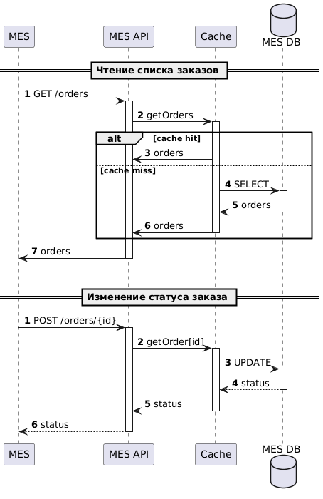

# Мотивация

Из-за того, что участились жалобы от операторов на то, что при заходе на первую страницу MES им приходится долго ждать, есть смысл ускорить получение данных из этой системы, применив кэширование.
Кэширование благотворно скажется на пользовательском опыте операторов MES, и поможет снизить нагрузку на базу данных.

# Предлагаемое решение

Для решения проблемы с медленной прогрузкой списка актуальных заказов нужно использовать серверное кэширование, т.к. операторов много и кэширование данных на стороне одного клиентского приложения не скажется никоим образом на пользовательском опыте других операторов. А сервер в этом случае для каждого оператора будет также обращаться в базу данных, чтобы сформировать полный (тяжеловесный) список актуальных заказов.
К кэшированию на клиентской стороне можно попробовать обратиться позднее, в теории, это может улучшить пользовательский опыт одного оператора, активно работающего на главной странице MES, когда работа над заказами в целом на производстве активно не ведется (все заняты текущей работой или в нерабочие часы). Тут можно сэкономить трафик между клиентом и сервером. Но может быть это ничего и не даст, например, потому что операторов и заказов так много, что изменения в системе происходят непрерывно и очень активно. В общем, тут требуется дополнительное исследование и анализ требований.

В виду того, что чтение данных по заказам в MES происходит активно, как и изменение состояния заказов, будем внедрять комбинацию из двух паттернов кэширования: Read-Through и Write-Through. Сервис MES API будет работать только с кэшом, чтение и запись данных о заказах будет производиться после кэша. Теоретически, можно заменить Write-Through на Write-Behind, это ускорит операции записи, но может привести к потере данных в случае неожиданного отказа MES при наличии незавершенных транзакций на запись в БД.

[Диаграмма PlantUML](./sequence_diagram.puml)

Стратегии инвалидации кэша
- при использовании одновременно паттернов Read-Through и Write-Through, можно не сильно волноваться о состоянии активно изменяемых заказов: данные будет инвалидироваться во время обновления
- для неактивных заказов подойдет инвалидация по TTL, например, в несколько часов или даже дней.